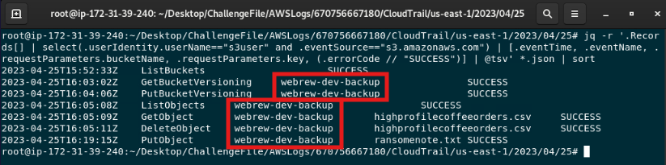
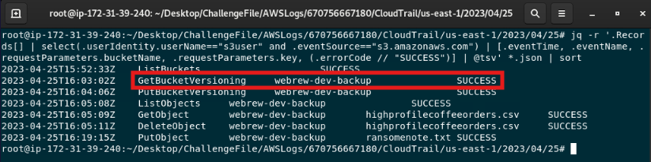
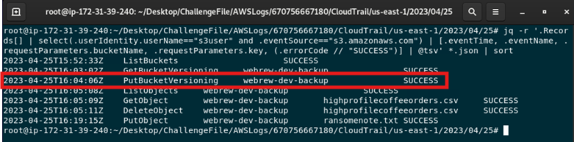
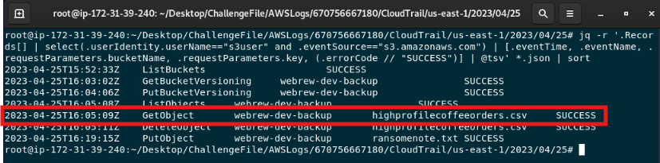
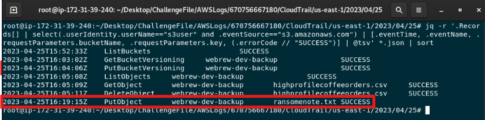

# AWS Bucketware — Credential Compromise Investigation

## Scenario Summary

An attacker used compromised AWS credentials to establish persistence within a cloud environment and prepare infrastructure for large-scale phishing campaigns. The objective is to reconstruct the attacker’s activity, identify persistence attempts, analyze changes to AWS resources, and determine the impact of the compromise.

The challenge is inspired by a real-world cloud ransomware scenario.

## Lab Setup

The challenge provides AWS CloudTrail logs from the affected environment.

### Lab Instructions

1. Become root:

```bash
sudo su
```

2. Extract the AWS log archive:

```bash
unzip /root/Desktop/ChallengeFile/AWSLogs.zip -d /root/Desktop/ChallengeFile/
```

3. Navigate to the CloudTrail log directory:

```bash
cd /root/Desktop/ChallengeFile/AWSLogs/670756667180/CloudTrail/us-east-1/2023/04/25/
```

4. Decompress the CloudTrail log files:

```bash
find . -type f -exec gunzip {} \;
```

## Investigation Objectives

The investigation aims to identify the compromised AWS identity, reconstruct attacker reconnaissance activity, analyze attempted IAM persistence, identify affected S3 resources, determine what protections were modified, and assess data access and ransom activity.

## Evidence Sources

- AWS CloudTrail logs
- IAM API activity
- S3 API activity
- Request parameters
- Response and error codes
- Object access activity

## 1. Identify the Compromised Identity

### Question

What is the compromised identity?

### Analysis

I reviewed CloudTrail activity associated with the observed IAM identities. The `s3user` account generated a sequence of suspicious reconnaissance, IAM, and S3 activity from the external source IP address `159.48.53.157`.

The activity included resource enumeration, attempts to create additional IAM users, S3 object access, bucket versioning changes, object deletion, and object creation.

This activity identified `s3user` as the compromised identity.

### Evidence


### Answer

`s3user`

## 2. Analyze Reconnaissance Activity

### Question

In order of occurrence, what were the last three reconnaissance API calls the attacker performed using the compromised credentials?

### Analysis

I reviewed the CloudTrail events associated with the compromised `s3user` identity and ordered the activity by timestamp.

The final three reconnaissance API calls were `GetBucketVersioning`, `ListObjects`, and `GetObject`. These actions allowed the attacker to inspect the S3 bucket's versioning state, enumerate stored objects, and retrieve an object.

### Evidence


### Answer

`GetBucketVersioning`, `ListObjects`, `GetObject`

## 3. Identify the First Successful Reconnaissance Call

### Question

What was the first successful reconnaissance API call?

### Analysis

I reviewed the reconnaissance activity associated with the compromised `s3user` identity and compared each event's result.

The initial `ListUsers` request returned `AccessDenied`. The following `ListBuckets` request completed successfully, making it the first successful reconnaissance API call.

### Evidence


### Answer

`ListBuckets`

## 4. Identify the Persistence Technique

### Question

How did the attacker attempt to maintain persistence within the environment?

### Analysis

### Evidence

### Answer


## 5. Identify IAM Users Involved in the Persistence Attempt

### Question

In order of occurrence, which IAM users were involved in this persistence attempt?

### Analysis

I reviewed the full CloudTrail records for the three `CreateUser` attempts associated with the compromised `s3user` identity.

Although `requestParameters` was `null` for the failed requests, the attempted IAM usernames were recorded in the `errorMessage` field. In chronological order, the attacker attempted to create the following users:

1. `rooter`
2. `adm1n`
3. `dev0ps_user`

### Evidence


### Answer

`rooter`, `adm1n`, `dev0ps_user`

## 6. Determine Whether Persistence Succeeded

### Question

Were the persistence attempts successful?

### Analysis

All three `CreateUser` attempts returned `AccessDenied`. The compromised `s3user` identity did not have permission to create additional IAM users, so the attacker was unable to establish persistence using this method.

### Evidence

See the `CreateUser` events documented above, each of which returned `AccessDenied`.

### Answer

`No`

## 7. Identify the Affected S3 Bucket

### Question

Which S3 bucket was affected in this attack?

### Analysis

I filtered CloudTrail events associated with the compromised `s3user` identity for S3 activity.

The bucket `webrew-dev-backup` appeared repeatedly in the attack sequence, including versioning checks, object enumeration, object retrieval, deletion, and object creation.

### Evidence



### Answer

`webrew-dev-backup`

## 8. Analyze S3 Protection Discovery

### Question

How did the attacker check for protection on this resource?

### Analysis

I reviewed the S3 activity associated with the compromised `s3user` identity. The attacker issued the `GetBucketVersioning` API call against the `webrew-dev-backup` bucket.

This API call retrieves the bucket's versioning state, allowing the attacker to determine whether versioning protection was enabled.

### Evidence



### Answer

`GetBucketVersioning`

## 9. Analyze S3 Protection Modification

### Question

How did the attacker remove the protection on this resource?

### Analysis

I reviewed the S3 activity associated with the compromised `s3user` identity. After checking the bucket's versioning state, the attacker issued a `PutBucketVersioning` API call against the `webrew-dev-backup` bucket.

This action modified the bucket's versioning configuration and removed the protection that had been in place.

### Evidence



### Answer

`PutBucketVersioning`

## 10. Identify Exfiltrated Data

### Question

What file did the attacker exfiltrate?

### Analysis

I reviewed S3 object access activity associated with the compromised `s3user` identity. The `GetObject` event shows that the attacker successfully retrieved the file `highprofilecoffeeorders.csv` from the `webrew-dev-backup` bucket.

### Evidence



### Answer

`highprofilecoffeeorders.csv`

## 11. Identify the Ransom Note

### Question

What was the name of the ransom note?

### Analysis

I reviewed the S3 object activity associated with the compromised `s3user` identity. A successful `PutObject` event shows that the attacker uploaded a file named `ransomenote.txt` to the `webrew-dev-backup` bucket.

### Evidence



### Answer

`ransomenote.txt`

## Investigation Timeline

| Time (UTC) | Event | Details |
|---|---|---|
| 2023-04-25 15:51:31 | `ListUsers` | The compromised `s3user` identity attempted IAM enumeration and received `AccessDenied`. |
| 2023-04-25 15:52:33 | `ListBuckets` | The attacker successfully enumerated S3 buckets. |
| 2023-04-25 15:59:56 | `CreateUser` | The attacker attempted to create the IAM user `rooter`; the request was denied. |
| 2023-04-25 16:00:58 | `CreateUser` | The attacker attempted to create the IAM user `adm1n`; the request was denied. |
| 2023-04-25 16:02:00 | `CreateUser` | The attacker attempted to create the IAM user `dev0ps_user`; the request was denied. |
| 2023-04-25 16:03:02 | `GetBucketVersioning` | The attacker checked the versioning state of `webrew-dev-backup`. |
| 2023-04-25 16:04:06 | `PutBucketVersioning` | The attacker modified the bucket's versioning configuration. |
| 2023-04-25 16:05:08 | `ListObjects` | Objects in `webrew-dev-backup` were enumerated. |
| 2023-04-25 16:05:09 | `GetObject` | `highprofilecoffeeorders.csv` was successfully retrieved. |
| 2023-04-25 16:05:11 | `DeleteObject` | `highprofilecoffeeorders.csv` was deleted from the bucket. |
| 2023-04-25 16:19:15 | `PutObject` | `ransomenote.txt` was uploaded to the affected bucket. |

## Key Findings

- The compromised AWS identity was `s3user`.
- Suspicious activity originated from `159.48.53.157`.
- The attacker performed IAM and S3 reconnaissance before modifying resources.
- `ListBuckets` was the first successful reconnaissance API call.
- The attacker attempted to establish persistence by creating three IAM users: `rooter`, `adm1n`, and `dev0ps_user`.
- All three IAM persistence attempts were blocked with `AccessDenied`.
- The affected S3 bucket was `webrew-dev-backup`.
- The attacker checked the bucket's versioning state with `GetBucketVersioning` and modified it using `PutBucketVersioning`.
- `highprofilecoffeeorders.csv` was retrieved and subsequently deleted.
- A ransom note named `ransomenote.txt` was uploaded to the bucket.

## Identity and Access Analysis

The compromised `s3user` identity was able to enumerate S3 resources and perform destructive actions against the `webrew-dev-backup` bucket.

The attacker also attempted to create additional IAM users to establish alternate access paths. These attempts were unsuccessful because the identity did not have permission to perform `iam:CreateUser`.

This demonstrates that the permissions assigned to `s3user` limited some attacker activity, but still allowed access to sensitive S3 operations such as object retrieval, deletion, and bucket versioning modification.

## Security Control Analysis

The `AccessDenied` responses for the three `CreateUser` attempts demonstrate that IAM authorization controls successfully prevented the attacker from establishing persistence through additional IAM identities.

However, the compromised account retained sufficient permissions to enumerate S3 resources, retrieve and delete objects, and modify bucket versioning. These permissions increased the impact of the credential compromise.

S3 permissions associated with the affected identity should be reviewed against least-privilege requirements. Sensitive actions such as `DeleteObject` and `PutBucketVersioning` should only be available where operationally necessary.

Monitoring high-risk CloudTrail events could also provide earlier detection of suspicious activity, particularly repeated IAM enumeration, failed `CreateUser` attempts, bucket versioning changes, and unusual object access.

## Remediation Recommendations

- Revoke and rotate credentials associated with the compromised `s3user` identity.
- Review the IAM policies assigned to `s3user` and reduce permissions according to least privilege.
- Restore the intended versioning configuration on `webrew-dev-backup`.
- Review the affected bucket for unauthorized objects and remove `ransomenote.txt`.
- Assess whether deleted data can be recovered through existing S3 protections or backups.
- Investigate CloudTrail activity from `159.48.53.157` for additional malicious actions.
- Configure alerts for repeated IAM enumeration and failed IAM privilege or persistence attempts.
- Monitor high-risk S3 actions such as `PutBucketVersioning`, `DeleteObject`, and unusual `GetObject` activity.
- Require strong authentication controls for identities with access to sensitive cloud resources.

## Analyst Conclusion

CloudTrail analysis identified `s3user` as the compromised AWS identity. The attacker used the account from the external IP address `159.48.53.157` to enumerate AWS resources, attempt IAM persistence, and interact with the `webrew-dev-backup` S3 bucket.

The attacker attempted to create three additional IAM users, but each request was blocked by IAM authorization controls. Despite those failed persistence attempts, the compromised identity retained sufficient S3 permissions to inspect and modify bucket protections, retrieve `highprofilecoffeeorders.csv`, delete the object, and upload `ransomenote.txt`.

The incident demonstrates how a compromised cloud identity can still cause significant data impact even when some privilege-escalation or persistence actions are denied. Least-privilege IAM permissions, stronger credential protections, and monitoring of high-risk CloudTrail activity would reduce the impact of similar compromises.
