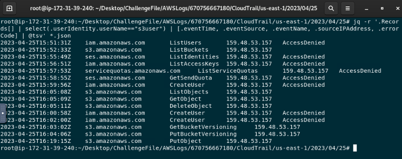
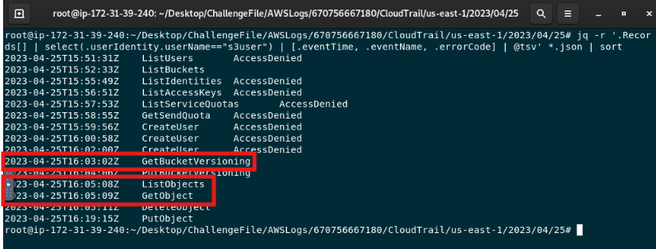
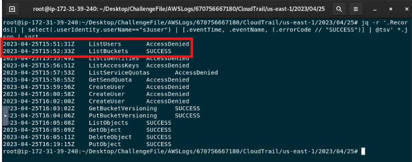
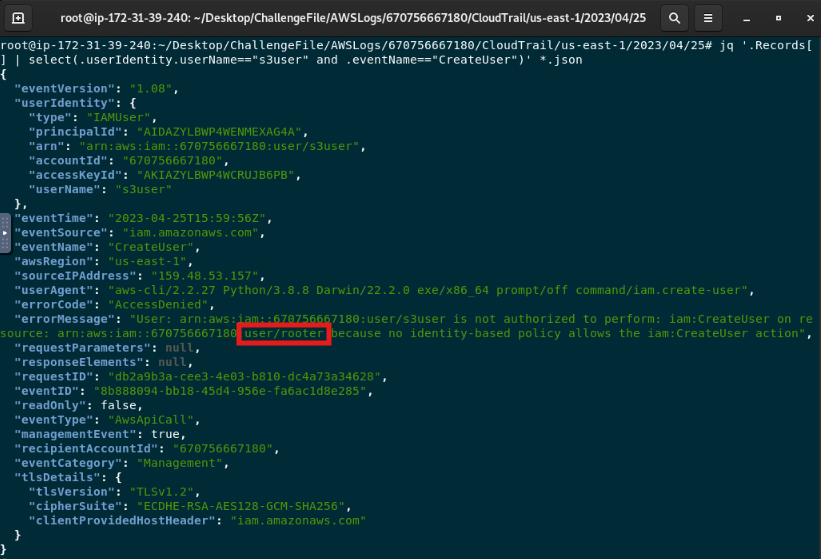
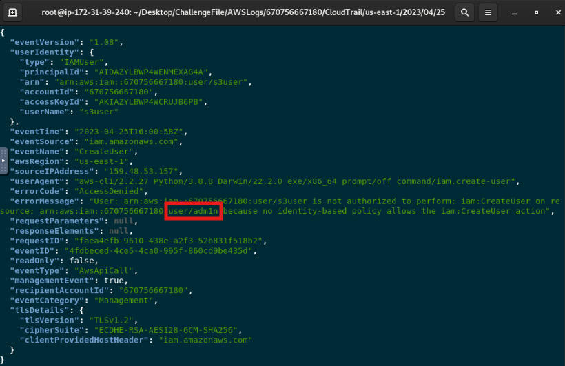
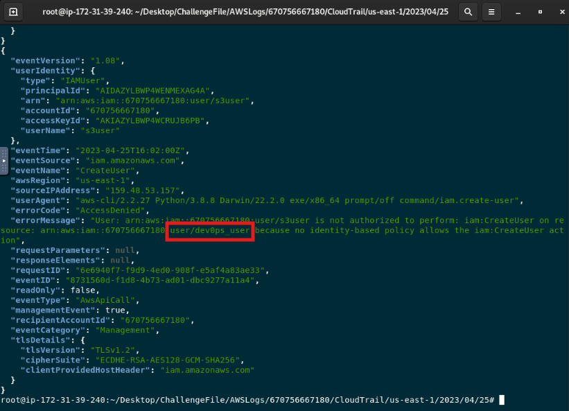

# AWS Bucketware — Credential Compromise Investigation

## Scenario Summary

An attacker used compromised AWS credentials to establish persistence within a cloud environment and prepare infrastructure for large-scale phishing campaigns. The objective is to reconstruct the attacker’s activity, identify persistence attempts, analyze changes to AWS resources, and determine the impact of the compromise.

The challenge is inspired by a real-world cloud ransomware scenario.

## Lab Setup

The challenge provides AWS CloudTrail logs from the affected environment.

### Lab Instructions

1. Become root:

```bash
sudo su
```

2. Extract the AWS log archive:

```bash
unzip /root/Desktop/ChallengeFile/AWSLogs.zip -d /root/Desktop/ChallengeFile/
```

3. Navigate to the CloudTrail log directory:

```bash
cd /root/Desktop/ChallengeFile/AWSLogs/670756667180/CloudTrail/us-east-1/2023/04/25/
```

4. Decompress the CloudTrail log files:

```bash
find . -type f -exec gunzip {} \;
```

## Investigation Objectives

The investigation aims to identify the compromised AWS identity, reconstruct attacker reconnaissance activity, analyze attempted IAM persistence, identify affected S3 resources, determine what protections were modified, and assess data access and ransom activity.

## Evidence Sources

- AWS CloudTrail logs
- IAM API activity
- S3 API activity
- Request parameters
- Response and error codes
- Object access activity

## 1. Identify the Compromised Identity

### Question

What is the compromised identity?

### Analysis

I reviewed CloudTrail activity associated with the observed IAM identities. The `s3user` account generated a sequence of suspicious reconnaissance, IAM, and S3 activity from the external source IP address `159.48.53.157`.

The activity included resource enumeration, attempts to create additional IAM users, S3 object access, bucket versioning changes, object deletion, and object creation.

This activity identified `s3user` as the compromised identity.

### Evidence



### Answer

`s3user`

## 2. Analyze Reconnaissance Activity

### Question

In order of occurrence, what were the last three reconnaissance API calls the attacker performed using the compromised credentials?

### Analysis

I reviewed the CloudTrail events associated with the compromised `s3user` identity and ordered the activity by timestamp.

The final three reconnaissance API calls were `GetBucketVersioning`, `ListObjects`, and `GetObject`. These actions allowed the attacker to inspect the S3 bucket's versioning state, enumerate stored objects, and retrieve an object.

### Evidence



### Answer

`GetBucketVersioning`, `ListObjects`, `GetObject`

## 3. Identify the First Successful Reconnaissance Call

### Question

What was the first successful reconnaissance API call?

### Analysis

I reviewed the reconnaissance activity associated with the compromised `s3user` identity and compared each event's result.

The initial `ListUsers` request returned `AccessDenied`. The following `ListBuckets` request completed successfully, making it the first successful reconnaissance API call.

### Evidence



### Answer

`ListBuckets`

## 4. Identify the Persistence Technique

### Question

How did the attacker attempt to maintain persistence within the environment?

### Analysis

### Evidence

### Answer


## 5. Identify IAM Users Involved in the Persistence Attempt

### Question

In order of occurrence, which IAM users were involved in this persistence attempt?

### Analysis

I reviewed the full CloudTrail records for the three `CreateUser` attempts associated with the compromised `s3user` identity.

Although `requestParameters` was `null` for the failed requests, the attempted IAM usernames were recorded in the `errorMessage` field. In chronological order, the attacker attempted to create the following users:

1. `rooter`
2. `adm1n`
3. `dev0ps_user`

### Evidence





### Answer

`rooter`, `adm1n`, `dev0ps_user`

## 6. Determine Whether Persistence Succeeded

### Question

Were the persistence attempts successful?

### Analysis

All three `CreateUser` attempts returned `AccessDenied`. The compromised `s3user` identity did not have permission to create additional IAM users, so the attacker was unable to establish persistence using this method.

### Evidence

See the `CreateUser` events documented above, each of which returned `AccessDenied`.

### Answer

`No`

## 7. Identify the Affected S3 Bucket

### Question

Which S3 bucket was affected in this attack?

### Analysis

### Evidence

### Answer


## 8. Analyze S3 Protection Discovery

### Question

How did the attacker check for protection on this resource?

### Analysis

### Evidence

### Answer


## 9. Analyze S3 Protection Modification

### Question

How did the attacker remove the protection on this resource?

### Analysis

### Evidence

### Answer


## 10. Identify Exfiltrated Data

### Question

What file did the attacker exfiltrate?

### Analysis

### Evidence

### Answer


## 11. Identify the Ransom Note

### Question

What was the name of the ransom note?

### Analysis

### Evidence

### Answer


## Investigation Timeline

## Key Findings

## Identity and Access Analysis

## Security Control Analysis

## Remediation Recommendations

## Analyst Conclusion
