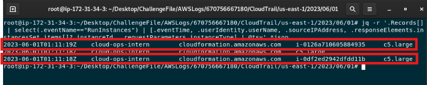
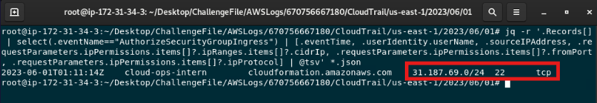

# AWS Stacked — CloudTrail Incident Investigation

## Scenario Summary

An unsuspecting cloud intern at MechZone clicks on an AWS phishing link, inadvertently deploying malicious resources into the company's cloud environment. The objective is to investigate the source of the compromise and identify the malicious resources staged by the attacker.

## Lab Setup

The challenge provides AWS CloudTrail logs from the affected environment.

### Lab Instructions

1. Become root:

```bash
sudo su
```

2. Navigate into the CloudTrail log directory:

```bash
cd /root/Desktop/ChallengeFile/AWSLogs/670756667180/CloudTrail/us-east-1/2023/06/01
```

3. Unzip the CloudTrail log files:

```bash
find . -type f -exec gunzip {} \;
```

## Investigation Objectives

The investigation aims to identify the compromised AWS identity, determine how malicious resources were deployed, analyze the resources created, review the network exposure introduced by the attacker, and identify the source of the compromise.

## Evidence Sources

- AWS CloudTrail logs
- IAM activity
- CloudFormation events
- EC2 activity
- Security group configuration
- Source IP information

## 1. Identify the Compromised Identity

### Question
What is the ARN of the compromised identity?

### Analysis

I reviewed the CloudTrail logs to identify IAM users present in the environment. Two identities were observed: `iamadmin` and `cloud-ops-intern`.

I then examined activity associated with `cloud-ops-intern`. The account was tied to suspicious resource creation activity, including `CreateUser`, `CreateSecurityGroup`, `CreateStack`, `AuthorizeSecurityGroupIngress`, and `RunInstances`.

This activity identified `cloud-ops-intern` as the compromised identity.

### Evidence


### Answer

`arn:aws:iam::670756667180:user/cloud-ops-intern`

## 2. Identify the Deployment Service

### Question
What AWS service was used to deploy malicious resources into the environment?

### Analysis

I filtered CloudTrail events associated with the compromised `cloud-ops-intern` identity for activity originating from `cloudformation.amazonaws.com`.

The logs showed a `CreateStack` event from the suspicious source IP address `31.187.69.154`, confirming that AWS CloudFormation was used to deploy the malicious resources.

### Evidence


### Answer

`CloudFormation`


## 3. Identify Malicious Compute Resources

### Question
How many malicious compute resources were deployed?

### Analysis

I filtered the CloudTrail logs for `RunInstances` events associated with the compromised activity.

Three `RunInstances` events were observed, but only two returned EC2 instance IDs, indicating that two compute resources were successfully deployed:

- `i-0126a710605884935`
- `i-0df2ed2942dfdd11b`

The remaining `RunInstances` event did not return an instance ID and therefore did not result in a deployed compute resource.

### Evidence



### Answer

`2`

## 4. Determine the Instance Type

### Question

What is the instance type observed for these resources?

### Analysis

The two successful `RunInstances` events both showed the instance type as `c5.large`.

### Evidence


### Answer

`c5.large`

## 5. Analyze the Malicious Security Group

### Question
What IP CIDR range did the malicious security group allow for inbound access?

### Analysis

I filtered the CloudTrail logs for `AuthorizeSecurityGroupIngress` events. The ingress rule associated with the compromised activity allowed traffic from the CIDR range `31.187.69.0/24`.

### Evidence



### Answer

`31.187.69.0/24`

## 6. Determine the Exposed Port

### Question
What port was allowed for inbound access?

### Analysis

I filtered the CloudTrail logs for `AuthorizeSecurityGroupIngress` events. The ingress rule associated with the compromised activity allowed traffic from the CIDR range `31.187.69.0/24`.

### Evidence


### Answer

`22`

## 7. Determine the Allowed Protocol

### Question
What protocol was allowed for inbound access?

### Analysis

I filtered the CloudTrail logs for `AuthorizeSecurityGroupIngress` events. The ingress rule associated with the compromised activity allowed traffic from the CIDR range `31.187.69.0/24`.

### Evidence


### Answer

`tcp`

## 8. Identify the Malicious IAM Identity

### Question
What is the user name given to the malicious identity that was deployed?

### Analysis

### Evidence

### Answer


## 9. Determine the Attack Source

### Question
What IP address did the attack originate from?

### Analysis

### Evidence

### Answer


## Investigation Timeline

## Key Findings

## Security Control Analysis

## Remediation Recommendations

## Analyst Conclusion
