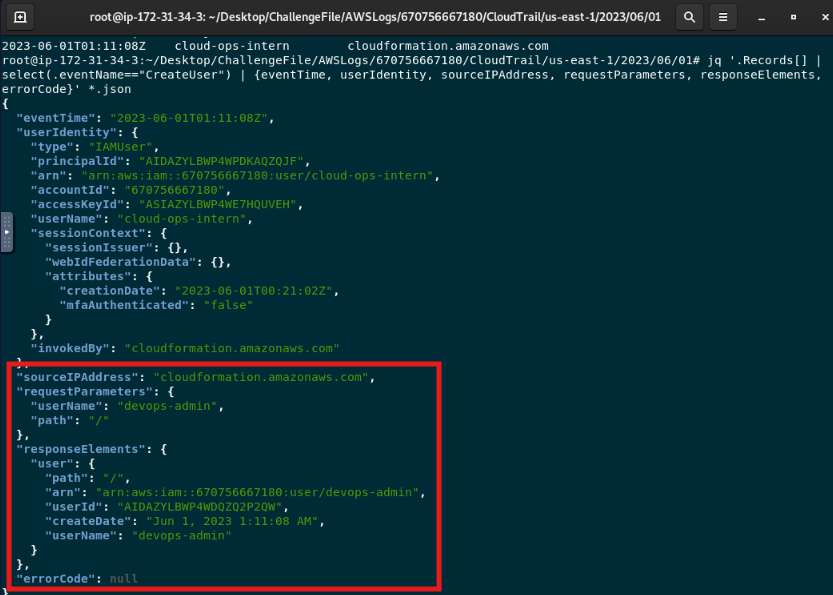
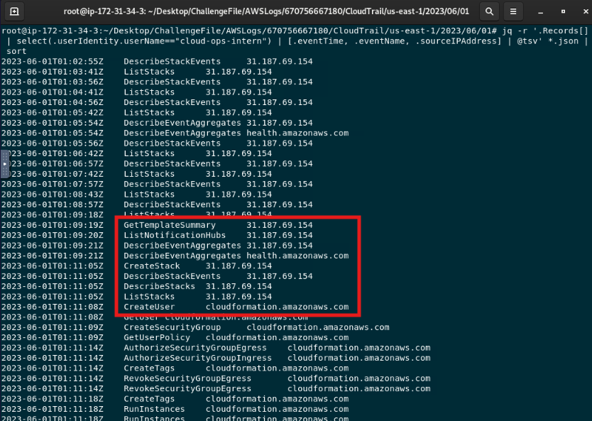

# AWS Stacked — CloudTrail Incident Investigation

## Scenario Summary

An unsuspecting cloud intern at MechZone clicks on an AWS phishing link, inadvertently deploying malicious resources into the company's cloud environment. The objective is to investigate the source of the compromise and identify the malicious resources staged by the attacker.

## Lab Setup

The challenge provides AWS CloudTrail logs from the affected environment.

### Lab Instructions

1. Become root:

```bash
sudo su
```

2. Navigate into the CloudTrail log directory:

```bash
cd /root/Desktop/ChallengeFile/AWSLogs/670756667180/CloudTrail/us-east-1/2023/06/01
```

3. Unzip the CloudTrail log files:

```bash
find . -type f -exec gunzip {} \;
```

## Investigation Objectives

The investigation aims to identify the compromised AWS identity, determine how malicious resources were deployed, analyze the resources created, review the network exposure introduced by the attacker, and identify the source of the compromise.

## Evidence Sources

- AWS CloudTrail logs
- IAM activity
- CloudFormation events
- EC2 activity
- Security group configuration
- Source IP information

## 1. Identify the Compromised Identity

### Question
What is the ARN of the compromised identity?

### Analysis

I reviewed the CloudTrail logs to identify IAM users present in the environment. Two identities were observed: `iamadmin` and `cloud-ops-intern`.

I then examined activity associated with `cloud-ops-intern`. The account was tied to suspicious resource creation activity, including `CreateUser`, `CreateSecurityGroup`, `CreateStack`, `AuthorizeSecurityGroupIngress`, and `RunInstances`.

This activity identified `cloud-ops-intern` as the compromised identity.

### Evidence


### Answer

`arn:aws:iam::670756667180:user/cloud-ops-intern`

## 2. Identify the Deployment Service

### Question
What AWS service was used to deploy malicious resources into the environment?

### Analysis

I filtered CloudTrail events associated with the compromised `cloud-ops-intern` identity for activity originating from `cloudformation.amazonaws.com`.

The logs showed a `CreateStack` event from the suspicious source IP address `31.187.69.154`, confirming that AWS CloudFormation was used to deploy the malicious resources.

### Evidence


### Answer

`CloudFormation`


## 3. Identify Malicious Compute Resources

### Question
How many malicious compute resources were deployed?

### Analysis

I filtered the CloudTrail logs for `RunInstances` events associated with the compromised activity.

Three `RunInstances` events were observed, but only two returned EC2 instance IDs, indicating that two compute resources were successfully deployed:

- `i-0126a710605884935`
- `i-0df2ed2942dfdd11b`

The remaining `RunInstances` event did not return an instance ID and therefore did not result in a deployed compute resource.

### Evidence


### Answer

`2`

## 4. Determine the Instance Type

### Question

What is the instance type observed for these resources?

### Analysis

The two successful `RunInstances` events both showed the instance type as `c5.large`.

### Evidence


### Answer

`c5.large`

## 5. Analyze the Malicious Security Group

### Question
What IP CIDR range did the malicious security group allow for inbound access?

### Analysis

I filtered the CloudTrail logs for `AuthorizeSecurityGroupIngress` events. The ingress rule associated with the compromised activity allowed traffic from the CIDR range `31.187.69.0/24`.

### Evidence


### Answer

`31.187.69.0/24`

## 6. Determine the Exposed Port

### Question
What port was allowed for inbound access?

### Analysis

I filtered the CloudTrail logs for `AuthorizeSecurityGroupIngress` events. The ingress rule associated with the compromised activity allowed traffic from the CIDR range `31.187.69.0/24`.

### Evidence


### Answer

`22`

## 7. Determine the Allowed Protocol

### Question
What protocol was allowed for inbound access?

### Analysis

I filtered the CloudTrail logs for `AuthorizeSecurityGroupIngress` events. The ingress rule associated with the compromised activity allowed traffic from the CIDR range `31.187.69.0/24`.

### Evidence


### Answer

`tcp`

## 8. Identify the Malicious IAM Identity

### Question
What is the user name given to the malicious identity that was deployed?

### Analysis

I reviewed the `CreateUser` CloudTrail event generated during the malicious CloudFormation activity.

The event's `requestParameters` and `responseElements` fields show that a new IAM user named `devops-admin` was created. The `errorCode` value was `null`, indicating that the user creation succeeded.

### Evidence



### Answer

`devops-admin`

## 9. Determine the Attack Source

### Question
What IP address did the attack originate from?

### Analysis

I reviewed CloudTrail activity associated with the compromised `cloud-ops-intern` identity and compared the source IP addresses across the suspicious events.

The external IP address `31.187.69.154` repeatedly appeared during the malicious CloudFormation activity, including `CreateStack`, `ListStacks`, and `DescribeStackEvents`.

### Evidence



### Answer

`31.187.69.154`

## Investigation Timeline

| Time (UTC) | Event | Details |
|---|---|---|
| 2023-06-01 01:09:19 | `GetTemplateSummary` | The compromised `cloud-ops-intern` identity queried CloudFormation from `31.187.69.154`. |
| 2023-06-01 01:11:05 | `CreateStack` | A CloudFormation stack was created from the suspicious source IP `31.187.69.154`. |
| 2023-06-01 01:11:08 | `CreateUser` | CloudFormation created the IAM user `devops-admin`. |
| 2023-06-01 01:11:09 | `CreateSecurityGroup` | A new EC2 security group was created. |
| 2023-06-01 01:11:14 | `AuthorizeSecurityGroupIngress` | The security group allowed TCP port `22` from `31.187.69.0/24`. |
| 2023-06-01 01:11:18 | `RunInstances` | EC2 instance `i-0df2ed2942dfdd11b` was successfully deployed as `c5.large`. |
| 2023-06-01 01:11:19 | `RunInstances` | EC2 instance `i-0126a710605884935` was successfully deployed as `c5.large`. |

## Key Findings

- The compromised identity was `cloud-ops-intern`.
- The malicious activity originated from `31.187.69.154`.
- AWS CloudFormation was used to deploy malicious resources.
- Two `c5.large` EC2 instances were successfully created.
- A new IAM identity named `devops-admin` was successfully deployed.
- A malicious security group permitted TCP port `22` from `31.187.69.0/24`.
- The attack used the compromised IAM identity to provision both compute and identity resources within the AWS environment.

## Security Control Analysis

The compromised `cloud-ops-intern` identity was able to invoke CloudFormation and provision IAM, EC2, and networking resources. This indicates that the account had permissions capable of making significant changes to the AWS environment.

CloudTrail evidence also showed `mfaAuthenticated` set to `false` for the compromised session. Requiring MFA would provide an additional authentication control against credential compromise.

The permissions available to the intern account should also be reviewed against the principle of least privilege. An intern account generally should not require unrestricted access to create IAM users, deploy CloudFormation stacks, launch EC2 instances, or modify security groups unless those permissions are explicitly required for the role.

The security group created during the attack exposed SSH over TCP port `22` to the CIDR range `31.187.69.0/24`, introducing an externally reachable management path to the malicious compute resources.

## Remediation Recommendations

- Revoke and rotate credentials associated with the compromised `cloud-ops-intern` identity.
- Require MFA for IAM users with console or privileged access.
- Review and reduce the permissions assigned to the compromised identity according to least privilege.
- Remove the malicious `devops-admin` IAM identity.
- Terminate unauthorized EC2 instances created during the incident.
- Remove the malicious security group and associated ingress rules.
- Review the CloudFormation stack and delete unauthorized resources created by it.
- Review CloudTrail activity for additional actions performed by the compromised identity.
- Configure monitoring and alerting for high-risk activity such as `CreateUser`, `CreateStack`, `RunInstances`, and security group modifications.
- Consider restricting infrastructure deployment through approved IAM roles and controlled CloudFormation workflows.

## Analyst Conclusion

CloudTrail analysis identified `cloud-ops-intern` as the compromised AWS identity. The attacker used the account from the external IP address `31.187.69.154` and leveraged AWS CloudFormation to deploy unauthorized resources.

The malicious deployment created the `devops-admin` IAM identity, an EC2 security group allowing SSH access from `31.187.69.0/24`, and two `c5.large` EC2 instances.

The incident demonstrates how compromised cloud credentials combined with excessive permissions can allow an attacker to rapidly provision identity, network, and compute resources. Stronger authentication, least-privilege IAM permissions, and monitoring of high-risk AWS API activity would reduce the likelihood and impact of similar activity.
